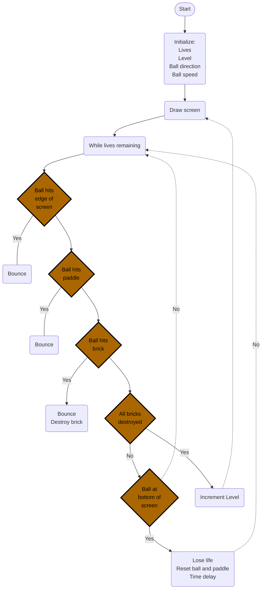

# Turtle Graphics - Breakout
## Design Notes

### Ideas:
1. Create background - fancy graphics 
2. Different layouts for levels
3. Design bricks - some bricks with special properties \
&emsp; Indestructible bricks used as barriers \
&emsp; Multiple hits to destroy \
&emsp; Explosive bricks \
&emsp; Drop bombs \
&emsp; &emsp; Kill player \
&emsp; &emsp; Deduct lives \
&emsp; &emsp; Deduct points \
&emsp; &emsp; Make paddle smaller for a time \
&emsp; &emsp; Fast ball for a time \
&emsp; Drop bonuses \
&emsp; &emsp; Extra points \
&emsp; &emsp; Extra lives \
&emsp; &emsp; Add gun to paddle for a time \
&emsp; &emsp; Ball can punch through bricks for a time \
&emsp; &emsp; Make paddle larger for a time \
&emsp; &emsp; Slow ball for a time \
&emsp; &emsp; Sticky paddle \
&emsp; &emsp; Add a row of bricks below the paddle
4. Design player paddle - use multiple turtles. 
5. Detect ball collision with paddle \
&emsp; Angle of bounce depends upon which segment is contacted 
6. Detect ball collision with brick \
&emsp; Angle of bounce depends upon which side of the brick is hit, \
&emsp; and direction of ball travel 
7. Create Algorithm to auto-generate brick patterns
8. Scoring and messages
9. Maybe a fancy screen when you win

## Bugs
If the ball hits at the bottom corner, then sometimes it reappears in the bottom right corner!
Sometimes the ball gets stuck between the bricks and the wall (particularly on the right wall), and it destroys a whole column of bricks. I have also seen this happen along the top of the screen, but not recently.
